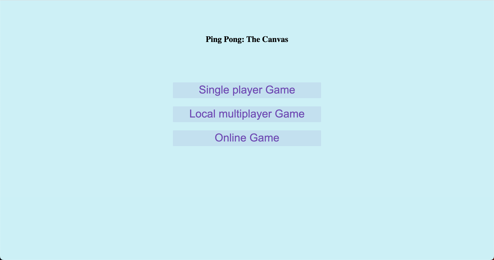

# Ping Pong Game

A fun and interactive Ping Pong game, built using HTML/CSS, Phaser.js and Netplay.js. Engage in a challenging match against the computer, or test your skills with a friend using the two-player mode.



## Technologies Used

1. **Phaser.js**:  Phaser is a fast, free, and fun open source HTML5 game framework that offers WebGL and Canvas rendering across desktop and mobile web browsers.
2. **Netplay.js**: For multiplayer mode, we utilize Netplay.js. This library is used to make peer-to-peer WebRTC-based multiplayer games in JavaScript, no server hosting or network synchronization code required!

## Features

- Single Player Mode: Practice your skills in a match against the computer.
- Two Player Mode: Compete with a friend on the same device.
- Online Mode: Test your abilities against players from around the world.

## Setup and Installation

Clone this repository to your local machine using:

```bash
git clone https://github.com/yourusername/ping-pong-game.git
```

Navigate to the project directory:

```bash
cd ping-pong-game
```

Install the required dependencies:

```bash
npm install
```

Then open the index.html file and enjoy!!!

## How to Play

- Use the `Arrow Up` and `Arrow Down` keys to move the paddle up and down respectively.
- In two player mode, player two can use the `W` key to move up and the `S` key to move down.
- Use the `Spacebar` to restart the game after every point. 
- The aim is to hit the ball with your paddle and make it pass your opponent's paddle.

Enjoy the game!

## Contributing

Pull requests are welcome. For major changes, please open an issue first to discuss what you would like to change.

## License

[MIT](https://choosealicense.com/licenses/mit/)

